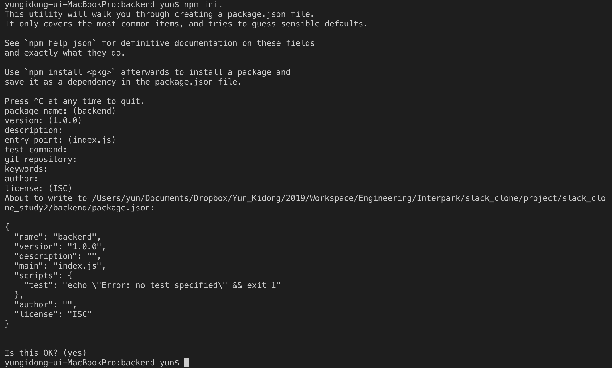

## 1. Backend

### The setting about postgresql + typeORM + typescript + graphql.

> 백엔드 서비스를 위한 루트 디렉토리를 만들자. 이름은 _'backend'_ 이다.

```
    workspace> mkdir backend
```

> 백엔드 디렉토리 안에서 _npm init_ 명령을 사용해 node 기반 서비스를 구성하기 시작함을 알리자.

```
    workspace/backend> npm init
```



> 그렇다면 위의 이미지와 같이 node 서비스에서 기본적으로 필요한 package.json 파일을 생성하기 위해서 많은 것들을 물어본다. 모두 Enter를 눌러서 무시해주자.

