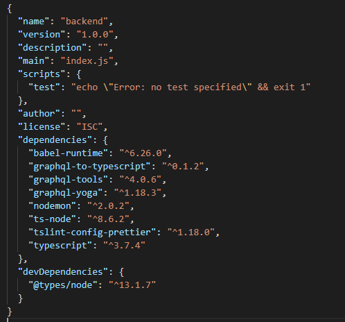
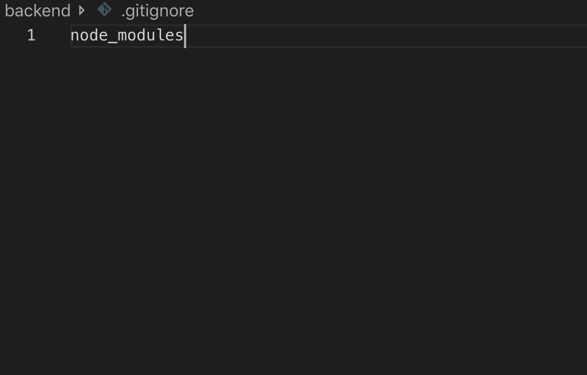
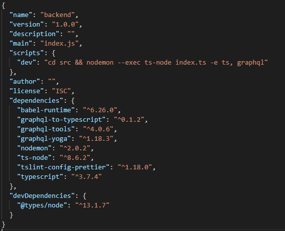
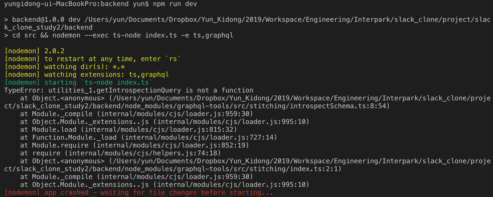

# typescript는 script language 인가?

> typescript는 스크립트 언어 즉 인터프리터를 사용하는 방식의 언어일까? 처음보는 아래와 같은 기술들을 찾아보면서 낯설게 들은 단어는 트랜스파일링이다. typescript는 결과적으로 봤을 때는 자바스크립트와 같은 인터프리터 방식의 언어가 아니며 오히려 자바와 같은 컴파일링 기반을 가진 언어라고 보는게 더 맞는 것 같다. 대부분이 아는 특징인 정적 타입 지정을 할수 있고 또 상속, 인터페이스 등의 구현이 가능하다.
그렇다고 해서 온전한 컴파일을 하는 것은 아니여서 많은 개발자들이 이러한 언어들을 트랜스파일링 언어라고 부르는 것 같다. 트랜스파일 작업은 미리 구현되어져 있는 helper 함수를 활용해서 타입스크립트로 구현한 파일들을 트랜스파일링하게되면 자바스크립트로 변환되어진다.


# Backend

## 1. postgresql + typeORM + typescript + graphql 기초 설정하기

## (1) node package 설치하기

### A. backend 폴더 생성하자.

> 백엔드 서비스를 위한 루트 디렉토리를 만들자. 이름은 _'backend'_ 이다.

```
    workspace> mkdir backend
```

### B. package.json 파일 생성하자.

> 백엔드 디렉토리 안에서 _npm init_ 명령을 사용해 node 기반 서비스를 구성하기 시작함을 알리자.

```
    workspace/backend> npm init
```


### C. 필요한 package 들을 설치하자.

> 그렇다면 위의 이미지와 같이 node 서비스에서 기본적으로 필요한 package.json 파일을 생성하기 위해서 많은 것들을 물어본다. 모두 Enter를 눌러서 무시해주자. <br><br> 이제 postgresql + typeORM + typescript + graphql 기술들을 사용하기 위해서 필요한 라이브러리, 모듈, 패키지들을 npm을 활용해 설치할 것이다. backend 폴더로 이동한 이후 아래의 명령어를 입력하자.

```
    workspace/backend> npm install graphql-to-typescript graphql-tools graphql-yoga nodemon ts-node tslint-config-prettier babel-runtime typescript
```


> 만약 설치가 잘 완료되었다면 _'package.json'_ 파일 안에 _'dependencies'_ 항목이 생기는데 위와같이 그 항목 안에 우리가 설치한 패키지들을 확인할 수 있다. 그 다음으로는 프로덕션 환경이 아닌 개발 환경에서만 사용할 패키지를 설치할 것이다. backend 폴더로 이동하여 아래와 같이 명령어를 입력하자. 

```
    workspace/backend> npm install --save-dev @types/node
```

> --save-dev 속성을 넣어주게되면 해당 패키지는 개발 환경의 의존성으로만 추가가 되며 package.json 에도 dependencies 항목이 아닌 devDependencies 항목에 추가가 된다.



### D. 각 package들의 역할을 간략하게 알아보자.

> 각 패키지들의 역할을 간략하게나마 소개하자면 아래와 같다.

#### graphql-to-typescript

> type, resolver와 같은 graphql 관련 설정들을 typescript 문법을 활용해서 작성할 수 있게 도와주는 패키지 인것 같다.

#### graphql-tools

> schema와 resolver를 분리해주는 구조를 만들어 주는 패키지라고 하는데 잘 모르겠다.

#### graphql-yoga

> React에서 _'create-react-app'_과 같이 손쉽게 graphql 설치를 할 수 있도록 도와주는 graphql 종합 패키지라고 보면 될 것 같다. 이 패키지를 설치하게 되면. 실제 서버의 역할을 해주는 _'express'_, _'apollo server'_ 패키지와 graphql 핵심 기능을 담고 있는 _'graphql.js'_, 위에서 설명한 _'graphql-tools'_, 그리고 웹 환경에서 GUI로 REQ/RES를 테스트할 수 있는 _'graphql-playground'_와 같은 IDE 등이 종합적으로 제공된다.

##### nodemon

> 서버가 실행중일 때 코드에 어떤 수정사항이 생기면 바로 적용할 수 있도록 도와주는 패키지이다.

#### babel-runtime

> Babel은 기본적으로 ES6/ES7 코드를 ECMAScript5 코드로 트랜스파일링하기 위한 도구이다.

#### ts-node

> 타입스크립트에서는 타입스크립트를 자바스크립트로 변환해주는 tsc 라는 도구를 제공한다. 이 도구를 이용하면 타입스크립트 코드가 그와 같은 기능을 하는 자바스크립트 코드로 변경되는데 이 과정을 transpile 이라 한다. 그러나 코드 수정이 일어날 때마다 매번 transpiling 작업을 하게되면 작업속도가 현저히 느려질 수 밖에 없는데 그래서 ts-node는 메모리상에서 타입스크립트를 transpiling 하여 바로 실행할 수 있게 한다.

#### tslint-config-prettier

> tslint는 typescript 언어를 작성할 때 코드 표준 규칙들을 잘 준수하고 있는지 체크해주는 정적 코드 분석 도구이며 prettier는 vscode에서 코드를 정리해주는 패키지이다.

#### typescript

> typescript 언어는 트랜스파일링 언어로 코드 작성 완료후 트랜스파일링 작업을 진행해야 하는데 이 패키지에 있는 tsc 도구 등을 통해 자바스크립트로 변환이 가능하다. java에서 jdk같은 느낌으로 받아들이자.

## (2) typescript + graphql 환경 구성을 위한 설정파일 작성하기

### A. '.gitignore' 파일을 생성해 git에 올릴 파일을 조절해보자.

> git commit/push 전에 node_modules 폴더 내부를 보자. 우리가 설치한 패키지들 고작 몇개인데 그것들로 인해 node_modules 폴더는 수많은 파일들로 가득 차있다. 이 파일들도 git에 올리게 되면 참 고생길이 훤할 것이다. 또 정작 실제 소스들도 아님으로 그렇게 중요한 파일들은 아니다. git 업로드 내용에 제거하기 위해서 _'backend'_ 폴더 내부에 _'.gitignore'_ 파일을 생성하자. 그리고 그 안에 node_modules 라고 적자.

```
    workspace/backend> touch .gitignore
```

#### .gitignore
```
    node_modules
```



> 이렇게 하면 node_modules 폴더에 해당하는 파일들을 git remote repository로 업로드 되지 않는다.

### B. 4개의 환경설정 파일들 생성 및 작성

> 우선 typescript + graphql 기술들을 활용한 backend 환경을 구성하기 위해 필요한 설정 파일들을 만들자. 하나 알아둘 것은 현재 설치한 node package 들 중에 typeORM과 관련된 항목은 없는데 이는 이후에 관련된 package 들을 추가로 설치할 것이다. <br><br> backend 폴더에서 아래 4개의 파일을 만든다.

```

    workspace/backend> touch nodemon.json
    workspace/backend> touch tsconfig.json
    workspace/backend> touch tslint.json
    workspace/backend> touch .babelrc

```

> 각 파일들에 들어가야할 내용들은 아래와 같다. 파일이름이 헷갈리지 말고 각 내용들을 복사, 붙여넣기하자.

#### nodemon.json

```json

    {
      "ext": "ts graphql"
    } 

```

> 위 파일 _'nodemon.json'_ 에서 _"ext"_ 속성은 확장자를 의미하는데 그 속성값으로 적혀있는 확장자의 코드가 (여기서는 ts와 graphql) 수정될 경우 프로젝트는 새로고침된다.

#### tsconfig.json

```json

{
    "compilerOptions": {
      "baseUrl": ".",
      "module": "commonjs",
      "target": "es5",
      "lib": ["es6", "dom", "esnext.asynciterable"],
      "sourceMap": true,
      "allowJs": true,
      "moduleResolution": "node",
      "rootDir": "src",
      "forceConsistentCasingInFileNames": true,
      "noImplicitReturns": true,
      "noImplicitThis": true,
      "noImplicitAny": false,
      "strictNullChecks": true,
      "suppressImplicitAnyIndexErrors": true,
      "noUnusedLocals": true,
      "esModuleInterop": true,
      "skipLibCheck": true,
      "experimentalDecorators": true,
      "emitDecoratorMetadata": true,
      "experimentalDecorators": true
    },
    "exclude": [
      "node_modules",
      "build",
      "scripts",
      "acceptance-tests",
      "webpack",
      "jest",
      "src/setupTests.ts"
    ]
}

```

> tsconfig.json은 typescript가 js 파일로 transpiling 할 때 고려되어지는 설정 정보들을 담고있는 파일 같다. 자세히는 모르겠다.

#### tslint.json

```json

{
    "extends": ["tslint:recommended", "tslint-config-prettier"],
    "linterOptions": {
      "exclude": ["config/**/*.js", "node_modules/**/*."]
    },
    "rules": {
      "no-console": false,
      "member-access": false,
      "object-literal-sort-keys": false,
      "ordered-imports": true,
      "interface-name": false,
      "strict-null-checks": false
    },
    "rulesDirectory": []
  }

```

> TSlint, ESlint, JSlint 등 다양하게 있는데 이 들은 작성되어지는 코드들이 표준을 잘 지키는지 등을 확인하는 정적 분석 도구이다. 아마도 위 tslint.json 설정파일은 이 정적 분석 도구의 어떠한 설정을 하는 파일 같다.

#### .babelrc

```json

{
  "presets": ["@babel/preset-env"]
}

```

> babel 관련 설정파일 이겠지..

## (3) typescript + graphql 서버 구동을 위한 소스 작성 및 실행

### A. 소스 코드 생성

> 소스 코드를 담기위한 _'src'_ 폴더를 만들자. 현재 우리는 백엔드 환경을 구축하고 있는 것을 잊지 말자. 즉 backend 폴더 내부에 _'src'_ 폴더를 만들라는 의미다. 그리고 graphql 서버 실행을 위한 _'index.ts'_ 파일을 _'src'_ 폴더 안에 생성하자.

```

    workspace/backend> mkdir src
    workspace/backend/src> touch index.ts

```

#### index.ts

```ts

  import { GraphQLServer } from "graphql-yoga"
  // graphql-yoga 패키지를 GraphQLServer 라는 이름으로 가져온다.

  const typeDefs = `
    type Query {
      sayHello : String!
    }
  `
  // graphql server를 실행시키기 위해 필요한 파라미터 둘 중 하나 'typeDefs' 정의
  // 'typeDefs'는 인자값과 리턴되는 값의 타입을 지정한다. 
  // 추가적으로 'String!'에서 !는 null을 허용하지 않음을 의미한다. 

  const resolvers = {
    Query : {
      sayHello: () => "Hi there :0)"
    }
  }
  // graphql server를 실행시키기 위해 필요한 파라미터 둘 중 하나 'resolvers' 정의
  // 'resolvers'는 비지니스 로직이 실제로 들어가는 부분이다.

  const server = new GraphQLServer({ typeDefs, resolvers });
  // 'graphql-yoga'를 import한 GraphQLServer 객체와 위에 정의한 2개의 파라미터를 활용해 server 객체를 생성한다.
  // { } 이 표시는 왜 있을까? 한 객체로 파라미터를 전달한다는 의미일까?

  server.start(() => console.log('My first GraphQL Server is running on localhost:4000'))
  // 실제 서버를 실행시키는 코드이다.

```

### B. package.json script 수정

> node 기반 서비스들을 동작시키기 위해서 보통 npm, yarn 등의 패키지 관리자를 활용해 스크립트를 실행시킨다. 이 스크립트는 package.json 안에 script 속성을 활용해서 임의적으로 구현할 수 있으며 우리는 'index.ts' 에서 짠 graphql server가 잘 실행될 수 있도록 스크립트를 구성할것이다.

```json

  ...

  "scripts": {
      "dev": "cd src && nodemon --exec ts-node index.ts -e ts, graphql"
  }

  ...

```

> 기존에 존재하던 "test": "echo \"Error: no test specified\" && exit 1" 소스는 지우고 해당 부분에 위와 같이 "dev" 라는 이름을 가진 스크립트를 추가하자. 수정된 package.json 전문은 아래와 같다.

#### package.json

```json

{
  "name": "backend",
  "version": "1.0.0",
  "description": "",
  "main": "index.js",
  "scripts": {
    "dev": "cd src && nodemon --exec ts-node index.ts -e ts, graphql"
  },
  "author": "",
  "license": "ISC",
  "dependencies": {
    "babel-runtime": "^6.26.0",
    "graphql-to-typescript": "^0.1.2",
    "graphql-tools": "^4.0.6",
    "graphql-yoga": "^1.18.3",
    "nodemon": "^2.0.2",
    "ts-node": "^8.6.2",
    "tslint-config-prettier": "^1.18.0",
    "typescript": "^3.7.4"
  },
  "devDependencies": {
    "@types/node": "^13.1.7"
  }
}

```



### C. graphql server 실행하기.

> _'package.json'_ 안에 _'scripts'_ 속성 안에 "dev"에 해당하는 코드를 살펴 보면 src 폴더로 이동한 이후 _'index.ts'_ 파일을 ts-node를 활용해서 트랜스파일링 하고, 그 트랜스파일링된 js 파일을 nodemon으로 실행시키는 형태이다.

```
    1. src 폴더로 이동.
    
    2. ts-node를 이용해서 index.ts transpiling.

    3. nodemon으로 실행.
```

> 아래의 명령어를 통해 "dev" 스크립트를 실행시켜 보자.

```

  workspace/backend> npm dev run

```



> 혹시 위와 같은 오류가 전시되면서 실행이 안된다면 yarn 패키지 매니저를 설치하고 아래와 같이 명령어를 실행하자. / 위와 같은 에러가 나는 이유는 나도 잘 모르겠다.

```

  workspace/backend> yarn
  workspace/backend> yarn dev

```

> yarn 만 입력한 첫번째 명령어는 _'yarn'_ 패키지 매니저의 관련 기능들을 최신화 시켜주는 것이고 _'yarn dev'_ 명령어가 위의 _'npm dev run'_ 명령어와 동일하게 -'dev'_ 스크립트를 실행하는 역할을 한다.


> 위와 같은 로그가 보인다면 아래 링크를 클릭 혹은 'localhost:4000' 으로 접속해보자. 그러면 graphql-playground 패키지가 제공해주는 IDE를 확인할 수 있다.

[localhost:4000](http://localhost:4000/)

> 이 IDE는 postman의 역할과 유사하며, graphql 형식으로 REQ를 던지면 RES가 어떻게 나오는지를 확인해볼수 있다.


### D. graphql에서 스키마 에 대한 이해도 높이기.

> 

## (4) postgresql + typeORM + typescript + graphql 환경 구축하기

> 지금까지 작업한 내용은 typescript + graphql 까지만을 활용한 환경 구축하기였다. 이제 여기에 postgresql 데이터베이스와 

### 2020.01.16

GraphQL Schema 정보를 다른 폴더 구조로 뺴고 이들을 만든다음에 생성.

@ManyToOne 어노테이션 안에 값들이 대소문자가 구분되는데

=
setRelation(innderChannel, channel.messages)
-> 다 대 1이라는 관계를 설정한 것.


그거는 닉네임을 설정한거라고 생각하면 됨.

Channel as channel

다대다에대한 생각.

다대다 방식을 그대로 사용하여 모델링하는가.
혹은 중간에 한개의 테이블을 더 만들어서 구현하는가 의 개념.

일대다&다대일
부모와 자식의 관계에서 자식이 그 부모에 고유성을 가지는 것이면 일대다&다대일 관계를 사용.
그러나 고유성이 없다면 다대다 관계를 사용.

긍데 원래 디비 설계할 때 다대다도 다대일&일대다로 만들어야 되는뎅. -> 성능문제

schema.ts 파일이 이제 그래프큐엘 설정에 필요한 정보들 타입, 리졸버에대한 정의를 진행하는 파일.
사실 하나의 typeDef 안에 모든걸 정의할 수 잇다면, 리졸버도 그렇다면 이렇게 구분할 필요가 없지만.

만약 이것들을 정리를 하고 싶다면 다른 디렉토리, 파일들을 구현해 별도고 관리하고. 이것들이 schema.ts 로 임포트되고
마지막으로 이파일이 스키마를 정리해서 graphQLServer에 전달한다. 이 정보를 가지고 그래프큐엘 서버를 생성한다.

Message.graphql 과 Message.ts 의 차이는 타입도 다르고 뭐 다다름.
전자는 그래프큐엘 관점에서의 정의를 사용한거고.
후자는 엔티티 생성시 필요한 파일.

타입스크립트와 그래프큐엘을 같이사용하기 위해서는 일단 자료형 관리가 그래프큐엘을 위한것, 타입스크립트를 위한것
이렇게 두가지로 관리를 해야함 -> 이거는 아직 버전이 낮아서 개선이 안된 부분이라고 생각.

src/entities/Channel.ts -> 엔티티 즉 postgres를 위한 자료형,. 아니다 typeORM이라고 생각해야겠다.
Channel.graphql -> 그래프큐엘를 위한 자료형.

이 둘의 파일은 항상 싱크가 맞아야함 -> 둘의 구조가 동일해야함.
이건 사실 좀 안좋은 것 같은데.

GetMessages -> 이건 그래프큐엘에서 사용하는 api임. 리턴값과 파라미터들을 정의함.
GetMessages.graphql 이 파일은 그래프큐엘을 위한 타입. 확장자만 봐도 알 수 있다.

message

오늘 가장 큰 논점 주제는 graphql과 typeORM의 VO가 서로 상이해도 연결이 되는가 .

완전히 맞아야하는가. 아니면 약한 결합성을 가져서 완전히 맞지는 않아도 연결이 되는가.
이건 테스트 해보면 될것 같은데.


graphql
typedefs (파라미터)
->

->

->
graphql
return

typeORM에게 파라미터를 가공하기 위해서 typedef를 사용.

graphql typedef != ts typedef

typesrcipt에는 any타입이 없다.

d.ts -> 커스텀 타입 디피니션 파일

리졸버를 만들때마다 정의를 해야함.

Resolvers 는 지원해주지 않으니 우리가 만듬.

schema.ts 에서 각 파일들을 융합해서 관리하기 때문에 이 파일들끼리는 굳이 import해주지 않아도 된다

typeORM에서 주는 데이터를 그래프QL데서 받을 때 커스텀하게(뭘 빼고 받는다거나) 하려면 새로운 커스텀 타입을 정의해서 가져와야함.
혹은 리졸버 내부에서 새롭게 가공하거나.
